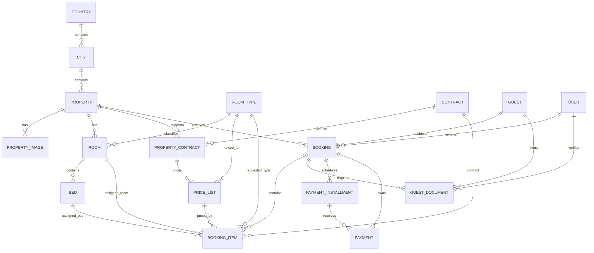

# 04 — Database Design

## Design Goals

- Relational source of truth in MySQL.
- Foreign-key integrity.
- Public UUID/reference/slug identifiers where appropriate.
- Soft deletes on recoverable business entities.
- No duplicate history tables for data already represented by transactional records.
- Backend relationships support operational and reporting views.

## Main Domain Groups

### Location / Property

- `countries`
- `cities`
- `properties`
- `property_images`

### Inventory / Pricing

- `room_types`
- `rooms`
- `beds`
- `contracts`
- `property_contracts`
- `price_lists`

### Guest / Booking

- `guests`
- `guest_documents`
- `bookings`
- `booking_items`

### Payments

- `payment_installments`
- `payments`
- `payment_gateway_events`

### Authentication / Infrastructure

- `users`
- Sanctum personal access tokens
- Spatie roles/permissions tables
- Laravel cache/jobs/sessions tables

## Core ERD



## Public Identifiers

| Entity | Public/route identifier |
|---|---|
| Property | `slug` |
| Booking | `booking_reference` + private token for public access; `uuid` for admin route binding |
| GuestDocument | `uuid` |
| Room and other business records | UUID fields exist for safe external references where needed |

Internal numeric IDs are still used for foreign-key joins.

## Booking Assignment Model

A public application creates a `booking_items` row with a requested `room_type_id` but `room_id = null`. During admin approval, the eligible physical room is assigned by setting `booking_items.room_id`.

This is also the relationship used for room history. Historical assignments remain queryable even after check-out because the booking and booking item remain normal business records.

## Overlap Rule

Two bookings conflict for a room when their date ranges overlap and the other booking has a blocking operational status. Current blocking statuses used by review logic are `awaiting_payment`, `confirmed`, and `checked_in`.

Conceptually:

```text
existing.check_in < requested.check_out
AND existing.check_out > requested.check_in
```

## Payment Model

A booking has one or more installments. Each Stripe Checkout/payment attempt is represented as a `payments` row tied to the booking and, when applicable, the installment. `payment_gateway_events` stores gateway event identity/status to prevent repeated webhook processing.

## Data Protection

- `guests.document_number` is encrypted by the model cast.
- `guests.document_number_hash` supports deterministic lookup/deduplication without plaintext search.
- `bookings.public_access_token` is encrypted; a SHA-256 hash is also stored for secure lookup/constant-time comparison.
- Guest document file path/hash are hidden from normal serialization.
