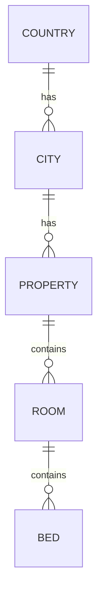

# Database Design Specification

**Project:** Alishan Accommodation Booking System

**Version:** 1.0

**Status:** Draft

**Prepared By:** Sajid

---

# 1. Overview

This document defines the database architecture for the Alishan Accommodation Booking System.

The goal is to create a scalable and production-ready database capable of supporting:

* Multiple accommodation properties
* Multiple room types
* Shared-bed bookings
* Entire-room bookings
* Contract-based pricing
* Online payments
* User authentication and authorization
* Future expansion without major schema redesign

This document serves as the reference for all Laravel migrations, Eloquent models, API development, and business logic.

---

# 2. Technology

| Item                | Technology                |
| ------------------- | ------------------------- |
| Database            | MySQL / MariaDB           |
| ORM                 | Laravel Eloquent          |
| Framework           | Laravel 12                |
| Frontend            | React (JavaScript)        |
| Authentication      | Laravel Sanctum           |
| Roles & Permissions | Spatie Laravel Permission |

---

# 3. Database Design Principles

The database follows these principles:

* Third Normal Form (3NF)
* Foreign key constraints
* Indexed relationships
* Soft deletes where appropriate
* Consistent naming conventions
* UUIDs are optional (currently using BIGINT IDs)
* Audit timestamps on every table

---

# 4. Naming Conventions

## Tables

Use plural names.

Examples:

* users
* properties
* rooms
* bookings

---

## Models

Use singular names.

Examples:

* User
* Property
* Room
* Booking

---

## Primary Keys

Every table uses:

- BIGINT UNSIGNED AUTO_INCREMENT
- Primary Key named id

Business tables may also include:

- UUID
- Slug
- Public Reference Number

---

## Foreign Keys

Examples:

* user_id
* property_id
* room_id
* booking_id
* contract_id

---

## Timestamps

Every table contains:

* created_at
* updated_at

---

# 5. Location Hierarchy

Country

↓

City

↓

Property

---

# 6. Booking Hierarchy

Property

↓

Room

↓

Bed

↓

Booking

↓

Payment

---

# 7. Initial Database Tables

## Core System

* users
* roles
* permissions

---

## Location

* countries
* cities

---

## Property Module

* properties
* property_images
* amenities
* property_amenity

---

## Room Module

* room_types
* rooms
* beds
* room_images
* room_prices

---

## Booking Module

* contracts
* bookings
* booking_beds
* booking_guests

---

## Payment Module

* payments

---

## Future Modules

* reviews
* coupons
* notifications
* maintenance_requests

---

# 8. Entity Relationship Overview

Users

↓

Bookings

↓

Payments

Bookings

↓

Rooms

↓

Properties

Rooms

↓

Beds

Rooms

↓

Room Prices

↓

Contracts

Properties

↓

Amenities

Properties

↓

Property Images

Rooms

↓

Room Images

---

# 9. Business Rules

## Property

* A property can contain multiple rooms.
* A property can have multiple images.
* A property can have multiple amenities.

---

## Room

* A room belongs to one property.
* A room belongs to one room type.
* A room can contain multiple beds.
* A room can have multiple prices.
* A room can have multiple images.

---

## Bed

* Every bed belongs to exactly one room.
* Beds may be booked individually.

---

## Contract

A contract defines pricing duration.

Examples:

* Monthly
* Semester
* Academic Year

---

## Room Price

A room can have different prices depending on the selected contract.

Example:

Room 101

Monthly → €450

Semester → €420

Yearly → €380

---

## Booking

A booking belongs to:

* one user
* one property
* one room
* one contract

A booking may reserve:

* an entire room
* one or more beds

---

## Payment

Every payment belongs to exactly one booking.

A booking may have:

* pending payment
* successful payment
* refunded payment

---

# 10. Booking Workflow

Home

↓

Select Property

↓

Select Booking Type

(Room / Shared Bed)

↓

Select Contract

↓

Select Check-in Date

↓

Select Check-out Date

↓

Search Availability

↓

Choose Room or Bed

↓

Guest Information

↓

Payment

↓

Booking Confirmation

---

# 11. Development Order

The database will be implemented in the following order:

1. countries
2. cities
3. properties
4. property_images
5. amenities
6. property_amenity
7. room_types
8. rooms
9. beds
10. room_images
11. contracts
12. room_prices
13. bookings
14. booking_beds
15. booking_guests
16. payments

---

# 12. Indexing Strategy

Indexes will be added for:

* email
* slug
* property_id
* room_id
* user_id
* contract_id
* booking_id
* city_id
* country_id

Composite indexes will be introduced where performance requires them.

---

# 13. Soft Deletes

Soft deletes will be enabled for:

* properties
* rooms
* beds
* bookings

Other tables will use hard deletes unless business requirements change.

---

# 14. Future Enhancements

Potential future features include:

* Dynamic pricing
* Seasonal pricing
* Discount campaigns
* Multi-currency support
* Multi-language content
* Property availability calendar
* Maintenance management
* Housekeeping module
* Invoice generation
* Reporting dashboard

